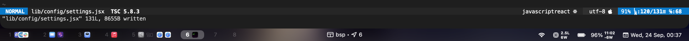
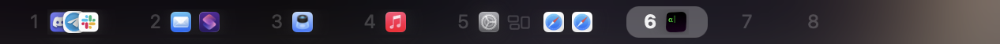
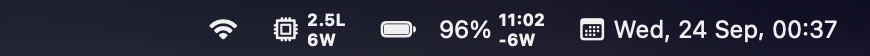
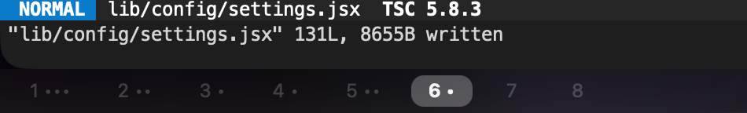
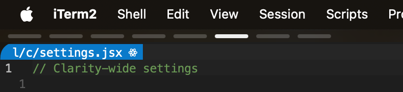

# Clarity

A simple [Übersicht](https://github.com/felixhageloh/uebersicht) widget status bar via [yabai](https://github.com/koekeishiya/yabai) support.
This status bar is designed to clearly show important details for virtual desktop management within a minimal amount of space, putting focus onto the task you're doing. Plus, it's updated to complement modern macOS design.

This uses [nibar](https://github.com/kkga/nibar) as a base and with some inspiration by [simplebar](https://github.com/Jean-Tinland/simple-bar)'s design and feature set.

Note that as a result of this being primarily for personal use, the design of this status bar may have changes over time.


## Screenshots

### Clarity v3

By default, it gives workspace indicators on the left, yabai status at the center and some other miscellaneous status items at the right. App icons are extracted from the .app bundle automatically and shown when opened. Your wallpaper is automatically blurred when you have any window open in the current space.



 - **Left (spaces):**
   
   Icons are automatically loaded from within the app package and cached within `clarity/appIcons`, and periodically refreshed every month.

 - **Center (yabai status):**
   

 - **Right (misc status):**
   

You can perform some basic customisation of its style via the `config/settings.jsx` file, while preserving its design language.

For example, you can choose a minimal design mode, adjust the sizes and toggle between top and bottom alignment.

By simply reducing the height value, you can shrink it down to a space-only indicator, which can be used and remain visible with yabai paddings alongside the macOS menu bar. Inspired by [@rosenpin's fork of this repo](https://github.com/rosenpin/clarity/tree/ba5ab5fcaab811a295a174baf83f6f37c369bb06).





<details markdown="1">
<summary>
[Click for extra config notes]
</summary>

- If used with Übersicht interaction enabled, it might be best to set `bar.jsx` to the background, while `status.jsx` and `spaces.jsx` are set to the foreground.
- Rarely, some app icons may not load correctly (can't locate `.icns` file or asset in `Assets.car`, can't find icon name from `Info.plist`, etc.) - You can manually create a 32x32 `.png` file in the auto-generated `appIcons` folder to supplement any missing app icons.

</details>

### Legacy Versions and Designs

Designs from legacy versions can now be achieved with similar results with only minor editing of config and styles of the current one, so there's no need to use code I no longer maintain.

If you still prefer to use them directly, you may find them in the legacy forks or tags, but note that the old codebase is also significantly more messy and harder to edit.

## Installation

Clone this repo to your Übersicht widgets directory.
```bash
$ git clone https://github.com/wernjie/clarity $HOME/Library/Application\ Support/Übersicht/widgets/clarity
```

Then, add the lines listed at the [refreshing yabai widgets section](#refreshing-yabai-widgets) to sync the widgets to yabai's state.

**PS:** take note of the [dependencies](#dependencies) required to make the widgets work correctly.

## Updating

First, pull changes from the live branch:
```sh
cd $HOME/Library/Application\ Support/Übersicht/widgets/clarity
git pull origin main
```

Then, make sure to **quit and restart Übersicht** (as Übersicht occasionally fails to correctly detect changes from git).

## Dependencies

- [`yabai` v5+](https://github.com/koekeishiya/yabai) with macOS 12+ - For window and desktop indicator and management.
- [SF Pro](https://developer.apple.com/fonts/) and [SF Symbols](https://developer.apple.com/sf-symbols/) - Apple's San Francisco font and symbols. Should be available by default on macOS.
- [acextract](https://github.com/bartoszj/acextract) - Assets.car extracter for extracting app icons if needed. Though, [acextract v2.2](https://github.com/bartoszj/acextract/releases/tag/2.2) is included in the `scripts/` directory and is automatically used.
- [`jq`](https://formulae.brew.sh/formula/jq) with macOS 13+ (optional) - Used in the status bar script to "parse" and confirm a converted `ioreg` output in JSON for detailed battery power stats. Only available on macOS 13+. (used for battery net power draw/input, and system power draw)

## Usage

### Widgets available

There are three widgets total:
- `spaces.jsx` for displaying workspaces (left). It has multi-display support.
- `bar.jsx` with yabai state indicators and provides a background blur.
- `status.jsx` for displaying selected status items (right).

### Configuration

Simple configuration options may be performed by editing `config/settings.jsx` and `config/styles.jsx`.

They are blank by default - you should start off by copying the contents of the `*.example.jsx` files onto the equivalent `*.jsx` files, then modifying the settings to your liking. All properties are clearly documented in comments.

**Note:** Avoid modifying the example files - those should be for reference only. That way, you can monitor when they are updated with new features, documentation changes, etc.

### Refreshing yabai widgets

The widgets for displaying yabai workspaces and status don't refresh automatically (to preserve battery). To refresh them, you can add these lines utilizing [yabai's signals](https://github.com/koekeishiya/yabai/wiki/Commands#automation-with-rules-and-signals) at the end of `.yabairc`:

```sh
# clarity config updates
REL_SPACES_IND="osascript -e 'tell application id \"tracesof.Uebersicht\" to refresh widget id \"clarity-spaces-jsx\"'"
REL_BAR_IND="osascript -e 'tell application id \"tracesof.Uebersicht\" to refresh widget id \"clarity-bar-jsx\"'"
REL_STATUS_IND="osascript -e 'tell application id \"tracesof.Uebersicht\" to refresh widget id \"clarity-status-jsx\"'"

# - if space indicators are enabled
yabai -m signal --add event=space_changed   action="$REL_SPACES_IND"
yabai -m signal --add event=space_created   action="$REL_SPACES_IND"
yabai -m signal --add event=space_destroyed action="$REL_SPACES_IND"
yabai -m signal --add event=display_changed action="$REL_SPACES_IND"
# - if app icon indicators within space indicators are enabled
yabai -m signal --add event=window_created   action="$REL_SPACES_IND"
yabai -m signal --add event=window_moved     action="$REL_SPACES_IND"
yabai -m signal --add event=window_resized   action="$REL_SPACES_IND"
yabai -m signal --add event=window_destroyed action="$REL_SPACES_IND"
yabai -m signal --add event=window_minimized   action="$REL_SPACES_IND"
yabai -m signal --add event=window_deminimized action="$REL_SPACES_IND"
yabai -m signal --add event=application_hidden action="$REL_SPACES_IND"
yabai -m signal --add event=application_visible action="$REL_SPACES_IND"
yabai -m signal --add event=mission_control_exit action="$REL_SPACES_IND"

# - if center space indicators are enabled
yabai -m signal --add event=space_changed    action="$REL_BAR_IND"
yabai -m signal --add event=space_created    action="$REL_BAR_IND"
yabai -m signal --add event=space_destroyed  action="$REL_BAR_IND"
yabai -m signal --add event=display_changed  action="$REL_BAR_IND"
# - if window titles or app names are enabled
yabai -m signal --add event=window_focused              action="$REL_BAR_IND"
yabai -m signal --add event=window_title_changed        action="$REL_BAR_IND"
yabai -m signal --add event=application_front_switched  action="$REL_BAR_IND"
# - if wallpaper blur is enabled
yabai -m signal --add event=window_created   action="$REL_BAR_IND"
yabai -m signal --add event=window_moved     action="$REL_BAR_IND"
yabai -m signal --add event=window_resized   action="$REL_BAR_IND"
yabai -m signal --add event=window_destroyed action="$REL_BAR_IND"
yabai -m signal --add event=window_minimized   action="$REL_BAR_IND"
yabai -m signal --add event=window_deminimized action="$REL_BAR_IND"
yabai -m signal --add event=application_hidden action="$REL_BAR_IND"
yabai -m signal --add event=application_visible action="$REL_BAR_IND"
yabai -m signal --add event=mission_control_exit action="$REL_BAR_IND"

# - if status indicators are enabled
yabai -m signal --add event=display_changed  action="$REL_STATUS_IND"

# refresh immediately on yabai load
sh -c "$REL_SPACES_IND"
sh -c "$REL_BAR_IND"
sh -c "$REL_STATUS_IND"

```

### Caveats

- Your wallpaper should not be too busy or too bright, as this status bar is only designed with a dark background in mind.
- Using yabai signals may cause you to have trouble quitting Übersicht without stopping yabai, since yabai events triggering a widget refresh may launch Übersicht even if it's not running.


