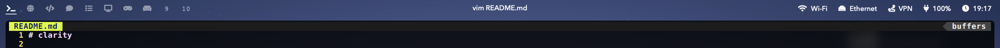

# clarity

A simple [Übersicht](https://github.com/felixhageloh/uebersicht) widget status bar with [yabai](https://github.com/koekeishiya/yabai) support, using [nibar](https://github.com/kkga/nibar) as a base.

`nibar` provided a great launchpad to jump right into custom status bars. It was utilised as a starting point, then overhauled to satisfy my taste.

## Screenshots

### Clarity v2


This version is designed to blend with macOS Big Sur's new menu bar, with a space indicator that's visible when a padding of 8px is set on all sides of the screen using yabai.

### Clarity v1

This version is designed as a full width custom menu bar with space indicators, app title, and status bar items, while the built-in macOS menu bar is hidden. The height is approximately 20px, and is best used with an additional 8px padding set to all sides of the screen using yabai, in addition to padding for the top bar.

## Installation

Clone this repo to your Übersicht widgets directory.

```bash
$ git clone https://github.com/wernjie/clarity $HOME/Library/Application\ Support/Übersicht/widgets/clarity
```

If you prefer the v1 version of clarity, switch to the commit for version 1. You should also refer to the Usage as listed in clarity v1 instead.

## Dependencies

- [jq](https://github.com/stedolan/jq) — used for parsing json output and displaying the workspaces widget
    - install with homebrew: `brew install jq`
- [Font Awesome 5 Free Solid](https://fontawesome.com/) — used for symbols in the statusbar widget

## Usage

### Yabai workspaces and title widgets

There are 2 widgets for displaying workspaces: `spaces-primary` and `spaces-secondary`.

All `*-secondary` widgets are used when working with dual displays.

If you're using a single display, disable the secondary display widgets in the Übersicht's menu. If you're working with dual displays, configure them accordingly.

### Refreshing yabai workspaces widget

The widgets for displaying yabai workspaces and window titles don't refresh automatically (to preserve battery). To refresh them, you can add these lines utilizing [yabai's signals](https://github.com/koekeishiya/yabai/wiki/Commands#automation-with-rules-and-signals) at the end of `.yabairc`:

#### When using a single display

```sh
yabai -m signal --add event=space_changed \
    action="osascript -e 'tell application id \"tracesof.Uebersicht\" to refresh widget id \"clarity-spaces-primary-jsx\"'"
```

#### When using dual displays

```sh
yabai -m signal --add event=space_changed \
    action="osascript -e 'tell application id \"tracesof.Uebersicht\" to refresh widget id \"clarity-spaces-primary-jsx\"'"
yabai -m signal --add event=display_changed \
    action="osascript -e 'tell application id \"tracesof.Uebersicht\" to refresh widget id \"clarity-spaces-primary-jsx\"'"

yabai -m signal --add event=space_changed \
    action="osascript -e 'tell application id \"tracesof.Uebersicht\" to refresh widget id \"clarity-spaces-secondary-jsx\"'"
yabai -m signal --add event=display_changed \
    action="osascript -e 'tell application id \"tracesof.Uebersicht\" to refresh widget id \"clarity-spaces-secondary-jsx\"'"
```

### Caveats

- Your wallpaper should not be too busy or too bright, as this status bar has no background.


