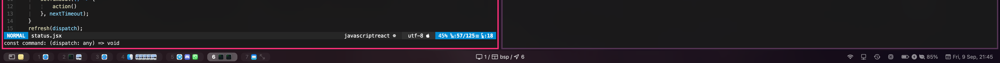
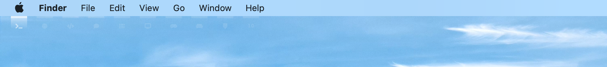
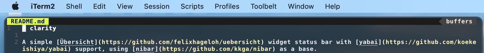
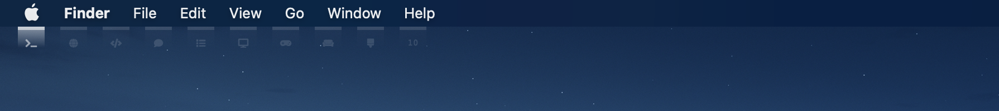

# Clarity

A simple [Übersicht](https://github.com/felixhageloh/uebersicht) widget status bar with [yabai](https://github.com/koekeishiya/yabai) support, using [nibar](https://github.com/kkga/nibar) as a base and with some inspiration by [simplebar](https://github.com/Jean-Tinland/simple-bar)'s design and feature set.

`nibar` provided a great launchpad to jump right into custom status bars. It was utilised as a starting point, then overhauled to satisfy my taste.

## Screenshots

### Clarity: Workspace Indicators with Status Bar items

Branch: `workspace-and-status`



This version is designed to complement macOS Big Sur+ menu bar by adding a new bottom bar. It may also replace the macOS menu bar if toggled to a top bar.

This provides workspace indicators on the left, yabai status at the center and some other miscellaneous status items at the right. App icons are extracted from the .app bundle automatically and shown when opened. Your wallpaper is automatically blurred when you have any window open in the current space.

*Config Notes:*
- The height of this bar is **28px**.
- If used with Übersicht interaction enabled, set `bar.jsx` to the background, `status.jsx` and `spaces.jsx` to the foreground.
- You may need to configure the background tint colour of this bar at `lib/styles.jsx` - `.colors.bgTint` property to match your wallpaper.
- You need to set `.alignBottom` to `false` in `lib/styles.jsx` to switch it to a top bar.
- Some app icons may not load correctly if they're not in a standard location (can't locate `.icns` file or asset in `Assets.car`, can't find icon name from `Info.plist`, etc.) - You can manually create a 16x16 `.png` file in the auto-generated `appIcons` folder to supplement any missing app icons.

### Clarity: Workspace Indicators only

Branch: `workspace-only`





This is a basic version designed to blend right below macOS Big Sur+ menu bar, with a workspace indicator that's visible when a padding of 8px is set on all sides of the screen using yabai.

## Installation

Clone this repo to your Übersicht widgets directory.
```bash
$ git clone https://github.com/wernjie/clarity $HOME/Library/Application\ Support/Übersicht/widgets/clarity
```
Choose the branch you prefer.
```bash
$ cd $HOME/Library/Application\ Support/Übersicht/widgets/clarity && git checkout <branch>
```
Refer to the README file in the specified branch for details, as they may differ from this one.

There are no guarantees that I'll update the other branches to reflect the latest yabai or macOS updates, except the one I'm currently using which will be in the `main` branch.

If you're forking this repository, I recommend forking from a specific branch if you want to fix a style, as I may change things frequently.

## Dependencies

- [SF Pro](https://developer.apple.com/fonts/) and [SF Symbols](https://developer.apple.com/sf-symbols/) - Apple's San Francisco font and symbols.
- [acextract](https://github.com/bartoszj/acextract) - Assets.car extracter for extracting app icons if needed. A binary is included in the `scripts/` directory ([acextract v2.2](https://github.com/bartoszj/acextract/releases/tag/2.2)).

## Usage

### Widgets available

There are three widgets total:
- `spaces.jsx` for displaying workspaces (bottom left). It has multi-display support.
- `bar.jsx` with yabai state indicators and provides a background blur.
- `status.jsx` for displaying miscellaneous status items (bottom right).

### Refreshing yabai widgets

The widgets for displaying yabai workspaces and status don't refresh automatically (to preserve battery). To refresh them, you can add these lines utilizing [yabai's signals](https://github.com/koekeishiya/yabai/wiki/Commands#automation-with-rules-and-signals) at the end of `.yabairc`:

```sh
REL_SPACES_IND="osascript -e 'tell application id \"tracesof.Uebersicht\" to refresh widget id \"clarity-spaces-jsx\"'"
REL_BAR_IND="osascript -e 'tell application id \"tracesof.Uebersicht\" to refresh widget id \"clarity-bar-jsx\"'"
yabai -m signal --add event=space_changed   action="$REL_SPACES_IND"
yabai -m signal --add event=display_changed action="$REL_SPACES_IND"
yabai -m signal --add event=window_created   action="$REL_SPACES_IND"
yabai -m signal --add event=window_moved     action="$REL_SPACES_IND"
yabai -m signal --add event=window_resized   action="$REL_SPACES_IND"
yabai -m signal --add event=window_destroyed action="$REL_SPACES_IND"
yabai -m signal --add event=window_minimized   action="$REL_SPACES_IND"
yabai -m signal --add event=window_deminimized action="$REL_SPACES_IND"
yabai -m signal --add event=application_hidden action="$REL_SPACES_IND"
yabai -m signal --add event=application_visible action="$REL_SPACES_IND"
yabai -m signal --add event=mission_control_exit action="$REL_SPACES_IND"

yabai -m signal --add event=space_changed    action="$REL_BAR_IND"
yabai -m signal --add event=display_changed  action="$REL_BAR_IND"
yabai -m signal --add event=window_created   action="$REL_BAR_IND"
yabai -m signal --add event=window_moved     action="$REL_BAR_IND"
yabai -m signal --add event=window_resized   action="$REL_BAR_IND"
yabai -m signal --add event=window_destroyed action="$REL_BAR_IND"
yabai -m signal --add event=window_minimized   action="$REL_BAR_IND"
yabai -m signal --add event=window_deminimized action="$REL_BAR_IND"
yabai -m signal --add event=application_hidden action="$REL_BAR_IND"
yabai -m signal --add event=application_visible action="$REL_BAR_IND"
yabai -m signal --add event=mission_control_exit action="$REL_BAR_IND"

# Refresh immediately on yabai load
osascript -e "$REL_SPACES_IND"
osascript -e "$REL_BAR_IND"
```

### Caveats

- Your wallpaper should not be too busy or too bright, as this status bar is only designed with a dark background in mind.


